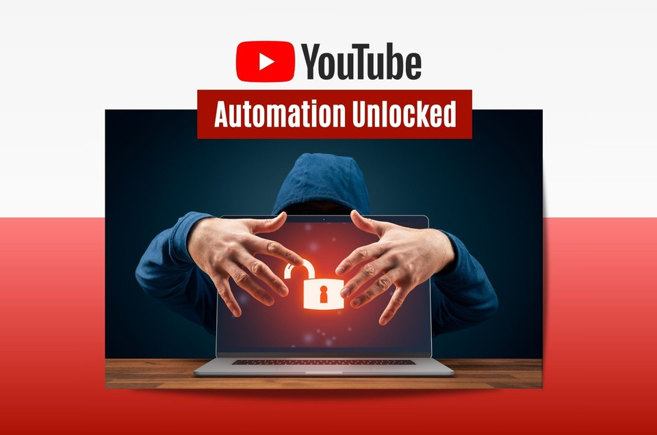

# 🚀 Viral Shorts Automation – Download, Rewrite, and Re-upload YouTube Shorts with AI



Welcome to **Viral Shorts Automation**, an automated system designed to download viral YouTube Shorts by topic, regenerate their titles and descriptions using Groq AI, and re-upload them seamlessly. This repository enables effortless video content recycling with AI-driven SEO-optimized rewrites, complete Google OAuth integration, and free Groq API usage.

---

## ⚙️ Setup & Installation

### 1. Clone the Repository

```bash
git clone https://github.com/VarunKurra/Viral-Shorts-Automation.git
cd Viral-Shorts-Automation
```

### 2. Google Cloud OAuth Setup

- Go to [Google Cloud Console](https://console.cloud.google.com/apis/credentials)
- Create a new project or select your existing one
- Enable YouTube Data API v3
- Create OAuth 2.0 Client IDs credentials (type: Desktop app)
- Download the `client_secret.json` file and place it in the root directory of this repo

### 3. Authorize Your Google Account

Run the app once to generate the token for OAuth:

```bash
python video_downloader_app.py
```

This will open a browser to authorize your Google account and generate a `token.pickle` file automatically.

### 4. Get Groq AI Free API Key

- Sign up at [Groq AI](https://groq.ai)
- Obtain your free API key
- Set environment variable in your terminal or add to a `.env` file:

```bash
export GROQ_API_KEY="your_groq_api_key_here"
```

Or create a `.env` file with:

```env
GROQ_API_KEY=your_groq_api_key_here
```

### 5. Install Dependencies

Create a `requirements.txt` file with:

```txt
google-auth-oauthlib
google-api-python-client
google-auth-httplib2
streamlit
requests
python-dotenv
```

Then install all dependencies:

```bash
pip install -r requirements.txt
```

---

## ▶️ How to Run

```bash
streamlit run video_downloader_app.py
```

Open the URL shown (usually http://localhost:8501) in your browser.

---

## 🧬 How It Works (Architecture)

1. **YouTube Shorts Download**: Searches and downloads viral Shorts by user-selected topic.
2. **AI Rewrite**: Uses Groq AI to regenerate video titles and descriptions with SEO-optimized hashtags.
3. **Google OAuth & YouTube Upload**: Authenticates via OAuth, then uploads rewritten Shorts automatically.
4. **Modular & Extensible**: Easy to add support for other video platforms or AI providers.
5. **Streamlit UI**: Simple, interactive frontend for running all steps locally.

---

## 🧠 Advanced Notes

- Keep your Google credentials and tokens **out** of public repos.
- Use `.gitignore` to exclude `client_secret.json` and `token.pickle`.
- For production, secure environment variables properly.
- Groq AI usage is free within limits; monitor API usage.
- Customize AI prompts inside `video_downloader_app.py` to suit your style.
- Troubleshoot OAuth errors by deleting `token.pickle` and re-authorizing.

---

## 📬 Contact / Support

Open issues here on GitHub or email `kurrav9605@parkwayschools.net`.

---

## 🏁 License

MIT License – See `LICENSE.md` for full terms.
